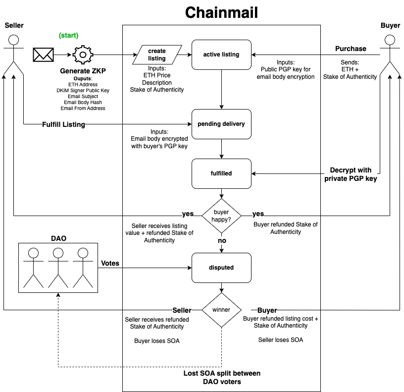

# Chainmail: ZKP Email Marketplace 📧🛡️

Chainmail is a marketplace for emails verified using Zero-Knowledge Proofs (ZKPs) to prove the authenticity of the sender whilst preserving the anonymity of the recipient.

## 🗺️ Project Overview

The project leverages [ZK Email](https://github.com/zkemail) to generate ZKPs of emails via their DKIM signatures.

By analysing the DKIM signature in the header of an email, we can verify the public key of the sender's domain. Find more details on DKIM [here](https://www.cloudflare.com/en-gb/learning/dns/dns-records/dns-dkim-record/).

After verification, a ZKP of the email is generated via a [circom](https://docs.circom.io/) circuit to verify the DKIM signature, provide public signals for details such as the sender, subject, body hash & ETH address of the owner.

Chainmail then provides a smart-contract backed marketplace to facilite the sale and transmission of these emails between buyers & sellers.

Transaction disputes are mediated via a Chainmail Voting Token.

## 🎯 Project Goals

- **Empower information distribution:** Provide a platform and mechanisms for encrypted transmission of email data.
- **Verify authenticity:** Ensure that information transferred between parties is authentic.
- **Protect privacy:** Redact the identity of an email recipient

## 🏗️ Project Structure

- [`app/`](./app) - React app for the marketplace
- [`circuits/`](./circuits) - circom circuitry
- [`foundry/`](./foundry) - Foundry project for marketplace & DAO contracts

## 🌊 Flow

## 📚 Getting Started

Navigate to the project folders for specific docs 🧐

 
 

This project is licensed under the [MIT License](https://opensource.org/license/mit)

Made with ❤️ at [EthBerlin04](https://ethberlin.org)

